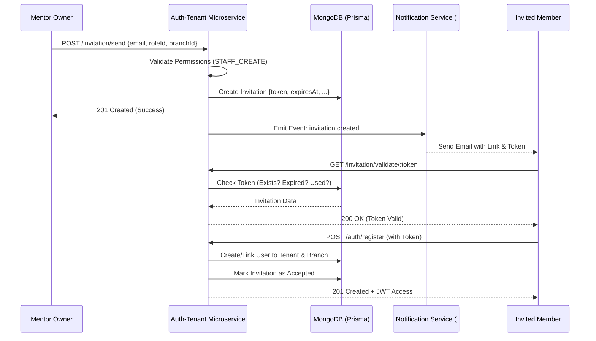

# Flujo de Invitación de Equipo 👥✉️

Este documento describe el proceso técnico y de negocio para invitar a nuevos miembros (Mecánicos, Recepcionistas, etc.) a un mentoría (Tenant) dentro del ecosistema **Quantic**.

## Overview
El objetivo es permitir que un `MENTOR_OWNER` o `SUPER_ADMIN` invite a una persona a su organización de forma segura, garantizando que el nuevo usuario nazca con el rol, mentoría y sucursal correctos.

## Diagrama de Secuencia



## Referencia de API

### 1. Enviar Invitación
`POST /invitation/send`
- **Seguridad**: Requiere `JwtAuth` y permiso `staff:create` o `saas:admin`.
- **Payload**:
  ```json
  {
    "email": "mecanico@garaje.com",
    "roleId": "676...",
    "branchId": "676..." // Opcional
  }
  ```
- **Lógica**: Genera un token de 128-bits. Expora en 7 días por defecto.

### 2. Validar Token
`GET /invitation/validate/:token`
- **Seguridad**: Público.
- **Respuesta**: Devuelve los detalles de la invitación (email, rol, tenant) si es válida.

### 3. Aceptar Invitación
`POST /invitation/accept/:token`
- **Seguridad**: Requiere `JwtAuth` (Usuario logueado).
- **Uso**: Para usuarios que YA tienen cuenta en Quantic y quieren unirse a otro mentoría.

## Reglas de Negocio & Seguridad
1. **Un Solo Pase**: No se pueden enviar múltiples invitaciones pendientes al mismo email para el mismo mentoría.
2. **Expiración**: El token queda inválido automáticamente después de 7 días.
3. **Uso Único**: Una vez aceptada (`acceptedAt != null`), el token ya no puede ser validado.
4. **RBAC Atómico**: La invitación determina el Rol final del usuario, impidiendo escalación de privilegios no autorizada.

---
*Documentación generada por Antigravity - Arquitectura SaaS Quantic.*
